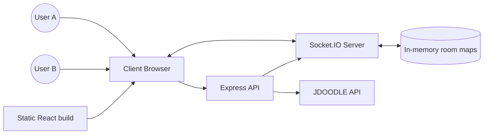
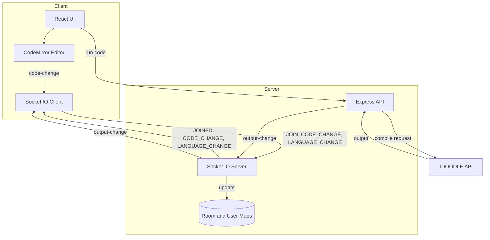

# CodeSync Interview Kit

A real-time collaborative code editor with shared output, built for pair programming, interviews, and live mentoring.

This README is intentionally long and interview-focused. It includes a deep walkthrough, data flow diagrams, future improvements, and a large Q and A bank to help you handle detailed interview questions.

---

## Table of Contents

- Elevator Pitch
- Deep Dive Walkthrough
- System Flow (End to End)
- Architecture Overview
- Data Flow Diagram (DFD)
- DFD Level 1 (Detailed)
- Data Dictionary
- API and Socket Events
- Failure Modes and Recovery
- Security and Privacy Notes
- Performance and Scalability Notes
- Future Improvements (Expanded)
- Interview Q and A (Deep)

---

## Elevator Pitch

### 30 second pitch
CodeSync is a real-time collaborative code editor where multiple users join a shared room, edit the same code simultaneously, and run it in 15 plus languages with shared output. The frontend is React with CodeMirror, while the backend is Express and Socket.IO for live sync plus a compile endpoint that proxies JDoodle. It is designed for fast onboarding: create a room, share the link, and start coding together instantly.

### 2 minute pitch (problem, solution, impact)
Most collaboration tools are optimized for chat or screen sharing, not for real-time code co-editing. CodeSync solves this by giving teams a live room with synchronized editing, language switching, and a shared execution console. Users generate or enter a room ID, join with a username, and edits stream through Socket.IO events to everyone in the room. A single backend endpoint compiles code via JDoodle so all participants see the same output. The result is a lightweight, interview-ready environment that feels like a shared IDE but runs entirely in the browser.

---

## Deep Dive Walkthrough

### 1) Entry and room creation
- The landing page routes to /Home.
- Users either generate a UUID room ID or paste an existing one, add a username, and join.
- The client navigates to /editor/:roomId with the username stored in router state.

### 2) Socket connection and presence
- EditorPage initializes a Socket.IO connection using initSocket.
- If socket init fails, the user is redirected back to the landing page.
- The client emits JOIN with roomId and username.
- The server tracks socketId to username and socketId to roomId in memory.
- The server broadcasts JOINED to everyone in the room.
- The new client receives existing code via SYNC_CODE so they are aligned immediately.

### 3) Real-time code sync
- The Editor component uses CodeMirror as the editor surface.
- On each local edit, the editor emits CODE_CHANGE to the room, excluding setValue updates.
- The server relays CODE_CHANGE to all other sockets in the same room.
- Remote clients apply the new code via setValue, keeping everyone in sync.

### 4) Language changes
- A language dropdown emits LANGUAGE_CHANGE to the server.
- The server broadcasts the new language to other clients in the room.

### 5) Run code and shared output
- The Run Code button sends POST /compile with code, language, and roomId.
- The server forwards the request to JDoodle and returns the output.
- The server also emits OUTPUT_CHANGE to the room so everyone sees the same result.

### 6) Leaving and reconnection
- Users can explicitly LEAVE, or disconnect automatically.
- The server broadcasts DISCONNECTED with the remaining client list.
- Socket.IO connectionStateRecovery and client-side reconnect logic rejoin the room.

---

## System Flow (End to End)

1. User A creates a room and joins.
2. User B joins the same room ID.
3. Server broadcasts JOINED and syncs the existing code to the new user.
4. User A edits; changes emit CODE_CHANGE and stream to User B.
5. User A runs code; backend compiles and broadcasts OUTPUT_CHANGE to all users.

---

## Architecture Overview

### Client (React)
- Routing: React Router with /, /Home, /editor/:roomId.
- Editor: CodeMirror in Editor.js.
- Realtime: Socket.IO client in Socket.js.
- UI: React components for room, members, and output panel.

### Server (Node.js)
- Express for REST endpoints.
- Socket.IO for realtime room events.
- In-memory maps for room and user tracking.
- JDoodle integration for multi-language execution.

---

## Data Flow Diagram (DFD)

### DFD Level 0 (Context Diagram)

### DFD Level 1 (Detailed Data Movements)

---

## Data Dictionary

- Room
	- roomId: unique string ID
	- members: set of socket IDs

- User
	- socketId: unique socket connection ID
	- username: display name
	- roomId: current room

- Code Buffer
	- code: string containing the current editor content

- Compile Output
	- output: string returned from JDoodle
	- language: selected language for compile

---

## API and Socket Events

### REST API
- POST /compile
	- payload: code, language, roomId
	- response: output and metadata from JDoodle

### Socket Events
- join: user joins a room
- joined: broadcast roster and notify room
- code-change: broadcast new code to room
- sync-code: send full code to a single socket
- language-change: broadcast selected language to room
- output-change: broadcast compile output to room
- leave / left: user initiated leave
- disconnected: server-side disconnect handler

---

## Failure Modes and Recovery

- Socket init failure: user is redirected to landing page.
- Network drop: Socket.IO reconnects; client re-joins room.
- Compile API failure: server returns error and broadcast output.
- Invalid language: server returns 400 error.

---

## Security and Privacy Notes

- Room IDs are unguessable UUIDs, but no auth is enforced.
- All data is ephemeral; no persistence by default.
- JDoodle credentials are stored on server via env vars.
- CORS restricts allowed origins.

---

## Performance and Scalability Notes

- Current design uses in-memory maps; works for a single server instance.
- Socket.IO connectionStateRecovery helps in short disconnects.
- High fanout rooms could be limited by server bandwidth.
- Long sessions could benefit from compression and diff based updates.

---

## Future Improvements (Expanded)

- Persist room state in Redis for multi-server scaling.
- Add cursor presence and selection highlights.
- Add authentication and role-based access (viewer and editor).
- Add code history and snapshots for rollback.
- Add file tree support and multi-file editing.
- Add editor language modes based on selected language.
- Add rate limiting for compile endpoint.
- Add server side validation for payload sizes.
- Add optional end to end encryption for code content.
- Add metrics and logging for room usage and compile latency.
- Add testing for sockets using a test harness.
- Add Docker Compose for local development.
- Add worker queue for compile requests.
- Add autoscale for peak interview loads.
- Add local execution sandbox with containerization.
- Add chat or voice integration for richer collaboration.
- Add room ownership and invite management.
- Add replay or time travel playback.
- Add collaborative cursor trails and colored highlights.
- Add offline mode with diff merge on reconnect.
- Add mobile optimized editor toolbar.

---

## Interview Q and A (Deep)

Q001: What problem does CodeSync solve?
A: It provides a shared, low friction coding room for pairing and interviews.
- Replaces screen share lag with true collaborative editing.
- Keeps all participants on the same source and output.
- Eliminates local setup for multi language execution.
- Supports quick onboarding with a room ID.

Q002: Who is the primary user of CodeSync?
A: Students, interviewers, mentors, and teams who need live code collaboration.
- Interview loops need fast room creation and shared output.
- Mentors can teach by editing alongside the learner.
- Teams can pair program without local environment setup.
- Classrooms can share a single room across attendees.

Q003: What is the core technical idea behind CodeSync?
A: Use Socket.IO rooms to broadcast edits and state changes in real time.
- Each room is keyed by a roomId.
- Every edit becomes an event sent to the server.
- The server relays the event to other sockets in the room.
- Clients apply edits to keep state consistent.

Q004: Why did you choose Socket.IO instead of plain WebSockets?
A: Socket.IO offers room management, reconnection, and fallbacks out of the box.
- Reconnection handling reduces custom code.
- Rooms simplify broadcasts to a specific group.
- Built in heartbeat and timeouts improve reliability.
- Fallback transports help in restrictive networks.

Q005: How does a user join a room?
A: The client emits a JOIN event with roomId and username.
- The server stores the mapping in memory.
- The socket joins the specified room.
- The server broadcasts JOINED to all members.
- The new client receives SYNC_CODE to align state.

Q006: How does the system keep code in sync?
A: Each editor change emits CODE_CHANGE and peers apply it.
- The editor ignores setValue to prevent echo loops.
- The server only relays the event to others.
- Clients update their editor content on receipt.
- The latest code is tracked in each client ref.

Q007: Why do you send full code instead of diffs?
A: Full code sync is simpler and reduces merge complexity.
- Smaller rooms keep payload sizes manageable.
- It avoids operational transform or CRDT complexity.
- It is easier to debug in interview settings.
- It is a clear future improvement target.

Q008: What happens when a new user joins an active room?
A: The existing client syncs the current code to the new socket.
- JOINED includes the new socketId.
- Existing client emits SYNC_CODE with current content.
- The new user receives CODE_CHANGE and sets editor value.
- The room is now consistent for all users.

Q009: How does language selection work?
A: The selected language is broadcast as LANGUAGE_CHANGE.
- The dropdown triggers language change in the client.
- The server relays it to other clients.
- All clients update their UI selection.
- It keeps output context aligned across users.

Q010: How is code execution implemented?
A: The server exposes POST /compile and proxies JDoodle.
- The client sends code and language.
- The server validates language against a whitelist.
- JDoodle executes and returns output.
- The server broadcasts OUTPUT_CHANGE to the room.

Q011: What data does the server store in memory?
A: Mappings from socketId to username and roomId.
- userSocketMap stores socketId to username.
- roomSocketMap stores socketId to roomId.
- This enables roster and disconnect events.
- It is cleared when sockets disconnect.

Q012: Why is in-memory state acceptable here?
A: The app targets short lived sessions where persistence is optional.
- Interview and pairing rooms are ephemeral.
- It keeps the architecture minimal and fast.
- It reduces operational dependencies for a demo.
- It can be replaced by Redis when scaling.

Q013: How does the server handle disconnects?
A: It removes the socket from maps and broadcasts DISCONNECTED.
- It checks the room and username mapping.
- It emits an updated roster to the room.
- It deletes the socket entries from maps.
- It keeps the room consistent for remaining users.

Q014: What is connectionStateRecovery used for?
A: It helps recover short disconnects without losing state.
- Socket.IO can replay missed packets.
- It reduces the impact of brief network hiccups.
- It keeps the room experience stable.
- It reduces the need for manual rejoin logic.

Q015: How do you avoid echo loops in the editor?
A: The client ignores setValue changes when emitting.
- CodeMirror sends change events for local edits.
- setValue changes are tagged with origin setValue.
- The client checks origin before emitting.
- This prevents broadcast loops.

Q016: What happens if two users type at the same time?
A: The last event received wins in current implementation.
- There is no operational transform or CRDT.
- Concurrent edits can override each other.
- The risk is acceptable for small rooms.
- A CRDT based improvement is a future step.

Q017: How does the compile output get shared?
A: The server emits OUTPUT_CHANGE to the entire room.
- The compile endpoint returns output to caller.
- The server also broadcasts output to peers.
- Each client updates its output panel.
- All users see consistent results.

Q018: Why use JDoodle instead of local execution?
A: It avoids running untrusted code on our own servers.
- It offloads resource heavy compilation.
- It supports multiple languages with minimal setup.
- It reduces operational complexity.
- It is suitable for MVP scale.

Q019: What happens if JDoodle fails?
A: The server returns an error response and emits an error output.
- The client displays the error message.
- The output panel is updated for visibility.
- The user can retry compilation.
- Failure does not break the room.

Q020: What makes the UI interview friendly?
A: It is focused and minimal with a clear run output panel.
- Room ID is visible and copyable.
- Member list shows presence.
- The editor is the main surface.
- The output panel is toggleable.

Q021: How does the client choose backend URL?
A: It uses REACT_APP_BACKEND_URL or defaults by environment.
- Local dev uses http://localhost:5000.
- Production uses the deployed URL.
- This keeps config simple.
- It supports quick switching between environments.

Q022: Why use React Router for routing?
A: It supports client side navigation with clean URLs.
- /Home for room join and create.
- /editor/:roomId for the editor.
- It keeps the routing declarative.
- It pairs well with React single page apps.

Q023: How is the editor implemented?
A: CodeMirror is initialized on a textarea with custom options.
- It provides line numbers and bracket closing.
- It uses a theme for readability.
- It supports controlled updates via setValue.
- It is lightweight for the browser.

Q024: Why CodeMirror instead of Monaco?
A: CodeMirror is lighter and easy to set up for an MVP.
- Monaco offers richer language services.
- CodeMirror has a smaller footprint.
- It is good for realtime editing demos.
- Monaco can be an upgrade later.

Q025: How do you maintain editor height and layout?
A: The editor is set to 100 percent height and wrapped in flex layout.
- The sidebar and editor area are flex children.
- The output panel toggles height.
- Mobile width switches to column layout.
- It remains usable on smaller screens.

Q026: How is the member list rendered?
A: The client maps the roster and renders Client components.
- Each member has a socketId and username.
- Avatars are generated from Dicebear.
- The list updates on JOINED and DISCONNECTED.
- The UI keeps live presence visible.

Q027: What data is stored on the client in refs?
A: The current code and socket are stored in refs.
- codeRef holds latest code text.
- socketRef holds the live socket instance.
- outputRef stores last output string.
- This avoids rerenders during typing.

Q028: How do you handle missing router state on refresh?
A: The editor route guards and redirects to root.
- If username is missing, it navigates away.
- This prevents undefined user state.
- It enforces the join flow.
- A future improvement is persisted auth state.

Q029: What happens on leave button click?
A: The client emits LEAVE and disconnects the socket.
- The server broadcasts DISCONNECTED.
- The client navigates to root.
- Room state updates for remaining members.
- This provides a clean exit path.

Q030: How is output panel toggled?
A: It uses local state to expand or collapse the panel.
- A button toggles isCompileWindowOpen.
- The panel height animates by style changes.
- Output is preserved in state.
- It keeps the editor focused when not running code.

Q031: What are the key server endpoints?
A: The server uses a single REST endpoint and Socket.IO events.
- POST /compile for execution.
- Socket events for realtime collaboration.
- Static file serving for client build.
- CORS for allowed origins.

Q032: How does the server validate input?
A: It checks presence of code and language plus a whitelist.
- Missing code or language returns 400.
- Unsupported language returns 400.
- Missing JDoodle creds returns 500.
- Errors are surfaced to clients.

Q033: Where are environment variables used?
A: They configure CORS and JDoodle credentials.
- CLIENT_ORIGIN controls allowed frontends.
- JDOODLE_CLIENT_ID and SECRET are required.
- PORT defines server listen port.
- REACT_APP_BACKEND_URL sets client base URL.

Q034: How does the server broadcast output?
A: It emits OUTPUT_CHANGE to the room if roomId is provided.
- This keeps outputs consistent across users.
- The compile caller also receives the response.
- The output panel updates in real time.
- It avoids manual sharing of output.

Q035: How do you manage CORS for sockets and REST?
A: Both Express and Socket.IO use allowedOrigins.
- It reads from CLIENT_ORIGIN env var.
- It falls back to localhost and deployed URLs.
- It trims and filters values.
- It keeps production access locked down.

Q036: Why use http server with Express and Socket.IO?
A: Socket.IO needs the underlying HTTP server for upgrades.
- The server is created with http.createServer.
- Express app is passed to the server.
- Socket.IO wraps the same server.
- This ensures both REST and sockets share a port.

Q037: What happens when a socket reconnects?
A: The client re-emits JOIN to re-enter the room.
- This restores presence after a drop.
- The server broadcasts JOINED again.
- The room roster updates accordingly.
- Code sync re-aligns the editor.

Q038: How do you prevent stale sockets in rooms?
A: On disconnect, the server deletes the socket mapping.
- It emits DISCONNECTED with updated roster.
- The room set is updated by Socket.IO.
- This reduces phantom users.
- The UI uses the roster from server.

Q039: How do you keep the output panel up to date?
A: OUTPUT_CHANGE updates output state and outputRef.
- Output is always in sync with latest run.
- The panel displays a placeholder when empty.
- Shared output ensures consistent feedback.
- It helps in interviews to share results.

Q040: What is the data flow for a compile request?
A: Client posts to /compile, server calls JDoodle, server broadcasts output.
- The client sends code and language.
- JDoodle returns output and status.
- Server emits OUTPUT_CHANGE to the room.
- All clients update the output panel.

Q041: Why do you use axios on the server and client?
A: It provides a clean promise based HTTP API.
- Client uses axios for compile request.
- Server uses axios to call JDoodle.
- It simplifies error handling.
- It is lightweight and common in Node projects.

Q042: How do you handle compile language mapping?
A: The server maps language names to JDoodle versionIndex.
- languageConfig defines the mapping.
- It allows stable version selection.
- It protects against unsupported languages.
- It can be extended easily.

Q043: How is the compile request rate controlled?
A: Currently it is not rate limited, which is a known gap.
- A future improvement is rate limiting per room.
- Another is server side queueing.
- JDoodle rate limits must be respected.
- The UI could also debounce run requests.

Q044: What happens if user sends huge code payloads?
A: The server accepts it but could hit memory and latency limits.
- Express uses JSON parsing without size limits by default.
- A future improvement is payload size limits.
- Large payloads could degrade broadcast performance.
- Compression is another improvement option.

Q045: Why not store code on the server?
A: The current design keeps state client side for simplicity.
- It avoids server memory growth.
- It reduces state sync complexity.
- It keeps the server stateless apart from maps.
- Persistence can be added for scaling.

Q046: How does the room roster update?
A: On JOINED and DISCONNECTED events, the client updates state.
- JOINED sends the full client list.
- DISCONNECTED removes one member.
- The UI displays the number of active members.
- It provides a presence indicator.

Q047: How do you ensure the socket is cleaned up?
A: The EditorPage cleanup removes listeners and disconnects.
- It removes JOINED, DISCONNECTED, LANGUAGE_CHANGE, OUTPUT_CHANGE.
- It removes connect and reconnect handlers.
- It disconnects the socket on unmount.
- This prevents memory leaks.

Q048: What kind of errors are shown to the user?
A: Socket errors and compile errors are shown via toasts and output.
- connect_error shows a toast and redirects.
- compile errors show in output panel.
- This keeps user feedback clear.
- It avoids silent failures.

Q049: Why use toasts for feedback?
A: Toasts are non-blocking and visible for quick actions.
- Room creation success is visible.
- Join failure is visible.
- Socket connection issues are visible.
- It keeps the UI responsive.

Q050: How does the app handle mobile layout?
A: It switches to column layout when width is below 900px.
- The sidebar becomes horizontal and collapsible.
- The editor area takes most height.
- The UI remains usable on tablets.
- It keeps the app flexible across devices.

Q051: Why keep the language list in the client?
A: It controls the dropdown options and aligns with server config.
- It is easy to update in one file.
- It avoids extra API calls.
- It is simple for an MVP.
- A future improvement is fetching from server.

Q052: How do you make sure client and server event names match?
A: They share identical strings defined in Actions files.
- The client has an Actions export.
- The server has Actions constants.
- This reduces typos across layers.
- A future improvement is a shared package.

Q053: Why is there no authentication?
A: The goal is minimal friction for interviews and demos.
- Room IDs act as basic access control.
- It keeps onboarding fast.
- It is a known security tradeoff.
- Auth is a clear future improvement.

Q054: What would be the first step to add auth?
A: Add login and store a user token on the client.
- Validate token on socket connection.
- Use middleware to reject invalid sockets.
- Use role claims for editor vs viewer.
- Store user profiles in a database.

Q055: How would you persist rooms across server restarts?
A: Store room data in Redis or a database.
- Save room roster and last code snapshot.
- Reload on server start.
- Use TTL to expire inactive rooms.
- This enables horizontal scaling.

Q056: How would you scale Socket.IO across multiple servers?
A: Use a shared adapter like Redis for pub sub.
- Socket.IO Redis adapter syncs events.
- Rooms are distributed across nodes.
- A load balancer routes clients to nodes.
- Sticky sessions or shared adapter required.

Q057: How do you ensure consistent code state after reconnect?
A: Re-emit JOIN and then SYNC_CODE from an existing client.
- The rejoined user gets latest code.
- The roster updates to show the user.
- This reduces divergence after brief drops.
- A server-side snapshot would be stronger.

Q058: What would be the complexity of adding CRDT?
A: It increases complexity but allows true concurrent editing.
- It requires per operation metadata.
- It needs conflict free merge logic.
- It can support offline changes.
- Libraries like Yjs can help.

Q059: How is the compile output formatted?
A: It is stored as a string and displayed in a pre block.
- The server normalizes output to string.
- It preserves line breaks.
- The UI shows a placeholder when empty.
- It keeps output readable.

Q060: How do you handle unknown languages?
A: The server checks languageConfig and returns 400.
- This prevents invalid JDoodle requests.
- It reduces error noise for users.
- The client only shows known languages.
- Server side validation is the final guard.

Q061: Why include client side language selection if editor mode is JS?
A: The editor mode can be extended; selection drives compile and output.
- Current mode is a limitation for MVP.
- It is a known improvement to map mode per language.
- It keeps UI ready for multi language editing.
- It still supports multi language execution.

Q062: How does the app serve the React build in production?
A: Express serves the build directory and returns index.html.
- The build path is configured at the end of server index.
- Static middleware serves assets.
- The wildcard route handles SPA routing.
- It simplifies deployment on a single server.

Q063: Why is the server code placed under server/index.js?
A: It keeps backend code isolated and supports a monorepo layout.
- The root package.json can run server dev.
- The client has its own package.json.
- The structure is easy to deploy.
- It keeps the repo organized.

Q064: How does the app avoid broadcast storms?
A: It only broadcasts to a room, not globally.
- Room level broadcasts reduce fanout.
- The server uses socket.in(roomId) for changes.
- Output changes are only emitted when needed.
- It keeps traffic limited to active rooms.

Q065: How do you test realtime features?
A: You can use multiple browser tabs or a socket test client.
- Run two clients and join the same room.
- Validate code sync and output updates.
- Simulate disconnect and reconnect.
- Add automated tests with socket.io testing libs.

Q066: What are the main risks in production?
A: Scaling sockets, handling concurrency, and protecting compile API.
- Many rooms can stress memory.
- Compile endpoint can be abused.
- Lack of auth is a security risk.
- JDoodle limits can be hit under load.

Q067: How do you secure the compile endpoint?
A: Add authentication and rate limiting.
- Require a session token.
- Limit requests per user or room.
- Validate code size and language.
- Add server side logging for abuse detection.

Q068: What are the main client side performance bottlenecks?
A: Large code payloads and frequent re-renders.
- Using refs reduces re-renders.
- CodeMirror handles large text efficiently.
- Socket payload size can be optimized.
- Diff based updates could further improve.

Q069: How is socket connection configured on the client?
A: The client sets reconnectionAttempts, timeout, and transports.
- forceNew ensures a fresh connection.
- timeout avoids hanging connections.
- transports include websocket and polling.
- This maximizes reliability across networks.

Q070: Why emit SYNC_CODE instead of direct state fetch?
A: It reuses socket channels and avoids extra REST endpoints.
- Existing clients already have latest code.
- The server does not store code.
- It keeps architecture minimal.
- It keeps bandwidth within the socket channel.

Q071: What is the role of outputRef on the client?
A: It keeps the latest output in a ref to avoid stale closures.
- It is useful for future features like streaming output.
- It avoids rerender loops.
- It keeps current output accessible.
- It allows quick updates without state churn.

Q072: How do you handle compilation while offline?
A: The UI blocks and shows an error if socket is disconnected.
- It checks socketConnected before running.
- It shows a toast when connection is lost.
- It avoids sending requests when disconnected.
- It keeps user informed.

Q073: Why use a separate Home page and HomePage?
A: HomePage is marketing style, Home is functional join flow.
- HomePage is the landing experience.
- Home is the room join form.
- Separation keeps UX clean.
- It allows style experimentation without breaking join flow.

Q074: What is the benefit of a room ID instead of named rooms?
A: Room IDs are unique and reduce collisions.
- UUID reduces guessability.
- It avoids naming conflicts.
- It is simple to share.
- It works well with ephemeral rooms.

Q075: What does the server do with LEAVE event?
A: It removes user from the room and broadcasts DISCONNECTED.
- It removes the socket from room.
- It deletes mapping entries.
- It broadcasts to remaining clients.
- It signals the leaving client with LEFT.

Q076: How is the roster computed on the server?
A: It reads the sockets in the room and maps to usernames.
- Socket IDs are read from adapter rooms.
- Each socketId maps to a username in memory.
- It returns an array of clients.
- It ensures accurate member lists.

Q077: How do you ensure user names are present?
A: The server checks roomId and username before joining.
- If missing, it disconnects the socket.
- It keeps room entries clean.
- The client also validates inputs.
- It avoids invalid room state.

Q078: What is the purpose of output placeholder in UI?
A: It guides the user to run code and sets expectation.
- It improves discoverability.
- It reduces confusion on first load.
- It maintains clean UI when empty.
- It is a small UX detail for clarity.

Q079: How would you add multi file support?
A: Add a file tree and send file change events per file.
- Maintain active file path in state.
- Emit file change events with path and code.
- Store file map in server or client.
- Update the editor based on selected file.

Q080: How would you add chat to the room?
A: Add a chat panel and a new socket event for messages.
- Emit CHAT_MESSAGE with text and user info.
- Broadcast to the room.
- Store chat history in state.
- Add timestamps and message IDs.

Q081: How would you handle very large rooms?
A: Consider splitting rooms or limiting membership.
- Add max participants per room.
- Reduce event frequency with batching.
- Use compression or diff based updates.
- Scale horizontally with a socket adapter.

Q082: Why choose a single compile endpoint for all languages?
A: It centralizes validation and simplifies the client logic.
- The client does not care about language specific endpoints.
- The server can map languages to versions.
- Logging and error handling are centralized.
- It reduces API surface area.

Q083: How do you store the selected language state?
A: It is stored in EditorPage state and synced via socket.
- The dropdown sets selectedLanguage.
- The event broadcasts to other clients.
- They update their local state.
- It keeps the UI consistent across users.

Q084: How do you handle different code per language?
A: Currently there is one shared buffer regardless of language.
- This is acceptable for an MVP.
- For multi file or multi language, use separate buffers.
- Keep a buffer per language or per file.
- Share the selected buffer per room.

Q085: How would you improve code consistency on concurrent edits?
A: Introduce CRDT or operational transform.
- Use Yjs or Automerge for CRDT.
- Sync updates as deltas with version vectors.
- Resolve conflicts deterministically.
- Enable offline edits with merge on reconnect.

Q086: How do you ensure UI remains responsive during large updates?
A: Use refs and avoid state updates on each keystroke.
- onCodeChange uses a ref for code storage.
- Rendering is not tied to every keystroke.
- Only the editor updates its internal state.
- This keeps React rendering minimal.

Q087: How do you guard against XSS in code output?
A: Output is displayed as text in a pre block.
- It is not rendered as HTML.
- This reduces XSS risk from output.
- Additional sanitization can be added.
- The compile service is treated as untrusted.

Q088: What happens if the client refreshes the editor page?
A: The router state is lost and the user is redirected.
- This avoids missing username issues.
- It forces rejoin through the Home page.
- It is a known limitation.
- A future improvement is persistent session storage.

Q089: How do you handle the case of multiple tabs by same user?
A: Each tab creates a new socket and appears as a separate member.
- This is acceptable for an MVP.
- A user ID could deduplicate later.
- Presence logic could merge by user ID.
- It would require authentication.

Q090: What is the role of the client side outputRef?
A: It keeps output consistent across asynchronous updates.
- It avoids closure problems in callbacks.
- It is useful for future streaming outputs.
- It supports potential copying of output.
- It avoids unnecessary state churn.

Q091: Why did you pick React for the frontend?
A: React enables component based UI and quick iteration.
- It has a mature ecosystem for routing and UI.
- It pairs well with Socket.IO client.
- It simplifies state and effect management.
- It is widely understood by interviewers.

Q092: How would you test the compile endpoint?
A: Use unit tests with mock JDoodle responses.
- Mock axios to return success and failure cases.
- Validate error handling and status codes.
- Ensure language validation is correct.
- Add integration tests for end to end flow.

Q093: How would you add logging for socket events?
A: Add middleware or event logging in connection handlers.
- Log JOIN, LEAVE, DISCONNECTED with roomId.
- Include socketId and username.
- Use a structured logger for production.
- Aggregate metrics for monitoring.

Q094: Why does the server return index.html for all routes?
A: It supports client side routing for the SPA.
- React Router handles the path.
- The server ensures a single entry point.
- It allows direct refresh on /editor/:roomId.
- It is a standard SPA deployment pattern.

Q095: How do you manage CORS for local and production?
A: The server reads CLIENT_ORIGIN and falls back to known URLs.
- Localhost and 127.0.0.1 are allowed.
- The deployed URL is whitelisted.
- It prevents random origins from connecting.
- It supports multiple frontends if needed.

Q096: How do you protect JDoodle secrets?
A: They are stored on the server in environment variables.
- The client never sees the secrets.
- The server calls JDoodle directly.
- Secrets are not committed to source control.
- It follows standard secret handling practices.

Q097: How would you implement streaming output?
A: Use server side streaming and emit output chunks.
- The server would emit OUTPUT_CHUNK events.
- The client appends to outputRef.
- The UI could show live progress.
- This is useful for long running code.

Q098: What is the advantage of a shared output panel?
A: It keeps all participants aligned on program behavior.
- Everyone sees the same output and errors.
- It reduces verbal back and forth.
- It helps interviewers follow the run.
- It creates a shared debugging context.

Q099: How is the room ID copied?
A: The client uses the clipboard API and shows a toast.
- It reduces friction when sharing links.
- It avoids manual selection.
- It improves UX for quick invites.
- It handles errors with a toast.

Q100: How would you add room expiration?
A: Add a server side TTL and cleanup job.
- Store room last activity timestamp.
- Periodically clean inactive rooms.
- Notify users before expiration.
- Use Redis TTL for automatic cleanup.

Q101: How would you handle large binary outputs?
A: Truncate or paginate output to keep UI responsive.
- Limit output size in server response.
- Provide a download link for full output.
- Add a client side max output length.
- Offer a clear warning when truncated.

Q102: What is the deployment strategy?
A: Build the React app and serve it from Express.
- npm run build in client generates static assets.
- Express serves the build directory.
- The server runs on a single port.
- It can be deployed to Render or similar.

Q103: How would you add CI tests?
A: Add a pipeline to run lint, unit tests, and build.
- Run client tests with react-scripts test.
- Run server tests with jest or mocha.
- Fail on build errors.
- Include security scans for dependencies.

Q104: What is the biggest tradeoff in this design?
A: Simplicity over strong consistency and persistence.
- Full code broadcasting is less efficient.
- No CRDT means conflicts can occur.
- No persistence means room state is lost.
- The tradeoff is acceptable for MVP.

Q105: How do you guarantee ordering of edits?
A: Socket.IO preserves ordering per connection, but concurrency can interleave.
- Each client emits events sequentially.
- The server relays in arrival order.
- Concurrent edits can still interleave.
- CRDT is the solution for strong ordering.

Q106: Why not store code in server and broadcast deltas?
A: It increases state management and complexity.
- The server would need to track code per room.
- It needs conflict handling logic.
- It makes scaling harder without shared state.
- The current design keeps server lean.

Q107: How do you handle compatibility with old browsers?
A: React and Socket.IO fallbacks cover most modern browsers.
- Polling transport is available.
- The UI uses standard CSS features.
- The app targets evergreen browsers.
- Polyfills can be added if needed.

Q108: How do you manage memory growth on the server?
A: The server only stores minimal maps and cleans on disconnect.
- Room maps are small.
- Sockets are removed on disconnect.
- There is no stored code history.
- This keeps memory footprint low.

Q109: How would you make the editor collaborative cursors?
A: Emit cursor position events and render overlays.
- Send cursor position on change or throttle.
- Map socketId to color and label.
- Render remote cursor markers in editor.
- Ensure updates do not impact typing performance.

Q110: How do you avoid flooding on each keystroke?
A: You could throttle or batch code changes.
- Emit changes at a fixed interval.
- Use debouncing for large payloads.
- Send only deltas for reduced bandwidth.
- This is a clear performance improvement.

Q111: What is the role of Toaster in the app?
A: It provides quick feedback for success and errors.
- Room creation and join status.
- Copy room ID feedback.
- Connection errors.
- General UX improvements.

Q112: How would you add user roles?
A: Add role metadata to JOIN and enforce in client UI.
- Host can assign viewer or editor.
- Server can block code changes from viewers.
- UI disables editor for viewers.
- Roles can be stored in a database.

Q113: How do you prevent unauthorized joins?
A: Add a secret room token or invite system.
- Generate a join token on room creation.
- Validate token on JOIN.
- Expire tokens when room is closed.
- Combine with auth for stronger security.

Q114: How do you handle multiple code runs at once?
A: The UI disables run button while compiling.
- isCompiling prevents multiple clicks.
- It avoids overlapping requests.
- Output reflects the latest run.
- A queue can be added for multiple requests.

Q115: How do you test the socket event flow?
A: Use unit tests with a Socket.IO test server or integration tests.
- Simulate JOIN and CODE_CHANGE events.
- Assert that clients receive correct broadcasts.
- Validate DISCONNECTED behavior.
- Use a headless browser for UI flow tests.

Q116: How would you improve editor language support?
A: Load CodeMirror modes based on selected language.
- Map language to a CodeMirror mode.
- Lazy load mode files for performance.
- Update editor configuration on language change.
- Show language specific formatting rules.

Q117: How would you implement room chat history?
A: Store messages in a backend data store with TTL.
- Save messages with roomId and timestamp.
- Load on room join.
- Limit history size for performance.
- Provide a clear history view in UI.

Q118: How do you handle typing latency?
A: Use WebSocket transport and keep payloads small.
- Prefer websocket transport over polling.
- Reduce payload size by sending deltas.
- Avoid extra React renders.
- Keep server in the same region as users.

Q119: How would you add file upload or paste for code?
A: Add a file input and read file into editor.
- Use FileReader to load content.
- Emit CODE_CHANGE to sync.
- Validate file size and type.
- Provide confirmation before replacing current code.

Q120: What is the plan for rate limits on JDoodle?
A: Add caching, backoff, and request throttling.
- Cache recent outputs for identical inputs.
- Throttle repeated runs by the same user.
- Show retry delays in UI.
- Consider a paid tier for higher limits.

Q121: How would you add monitoring and metrics?
A: Track room count, active sockets, and compile latency.
- Use a logging service or metrics library.
- Emit events on JOIN and DISCONNECT.
- Track compile response times.
- Build dashboards for visibility.

Q122: What would you change for enterprise readiness?
A: Add authentication, audit logs, and persistence.
- Single sign on integration.
- Role based access control.
- Room history and versioning.
- Compliance and data retention policies.

Q123: How do you prevent code loss on refresh?
A: Persist code in local storage or backend snapshots.
- Save on debounce to local storage.
- Restore on page load.
- Combine with server snapshots for cross device.
- Add snapshot timestamps for clarity.

Q124: How would you implement multi cursor selection?
A: Capture selection ranges and broadcast them.
- Emit selection start and end positions.
- Render remote selections in editor.
- Use unique colors per user.
- Throttle updates to avoid noise.

Q125: What would you add to make the UI more accessible?
A: Add ARIA labels, keyboard shortcuts, and contrast checks.
- Provide labels for buttons.
- Ensure focus outlines are visible.
- Add keyboard shortcuts for run and copy.
- Validate color contrast for readability.

Q126: How do you handle paste events with large text?
A: Allow the editor to handle it and consider chunked updates.
- The editor can accept large blocks.
- Broadcasting full text can be heavy.
- Chunking or compression could help.
- A prompt could warn on very large pastes.

Q127: How would you add a read only mode?
A: Add a toggle and block CODE_CHANGE emits for viewers.
- Disable editor input for read only.
- Keep receiving updates from others.
- Show a badge in UI for viewers.
- Enforce on server for safety.

Q128: How would you add a room owner role?
A: The first joiner becomes owner and can manage members.
- Owner can remove participants.
- Owner can lock the room.
- Owner can end the session.
- Owner can transfer ownership.

Q129: What is the biggest technical debt today?
A: Lack of strong concurrency control for edits.
- Full text sync can cause conflicts.
- No persistence for code history.
- Limited editor language modes.
- These are acceptable for MVP but need upgrades.

Q130: What is the most impressive part to highlight?
A: End to end realtime collaboration with shared execution output.
- Rooms are created and joined instantly.
- Edits sync with low latency.
- Output is shared across the room.
- The system is simple yet practical for interviews.
