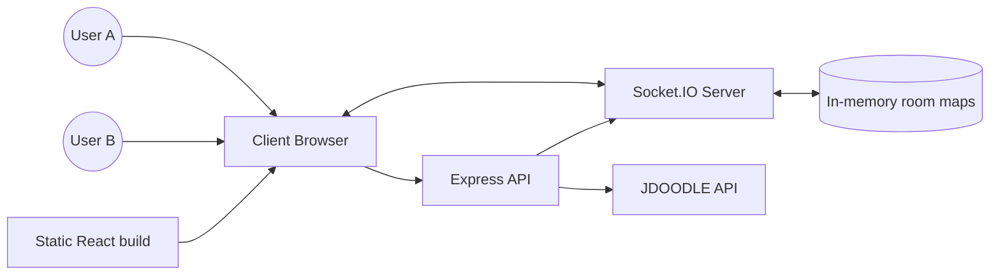
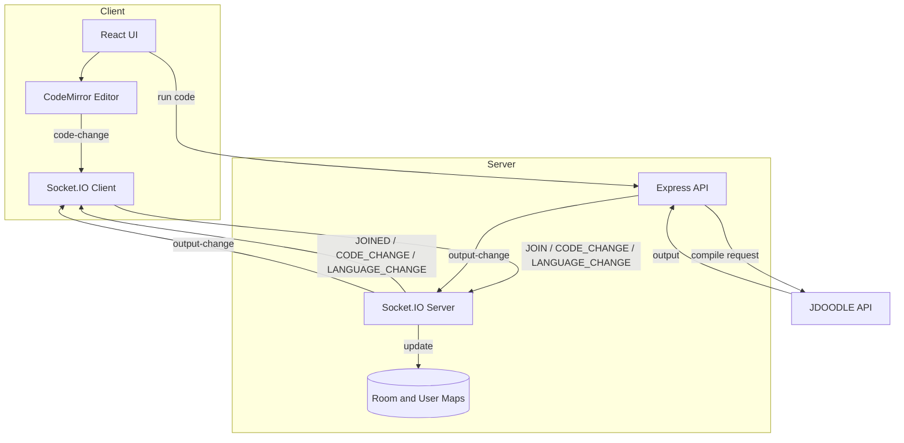
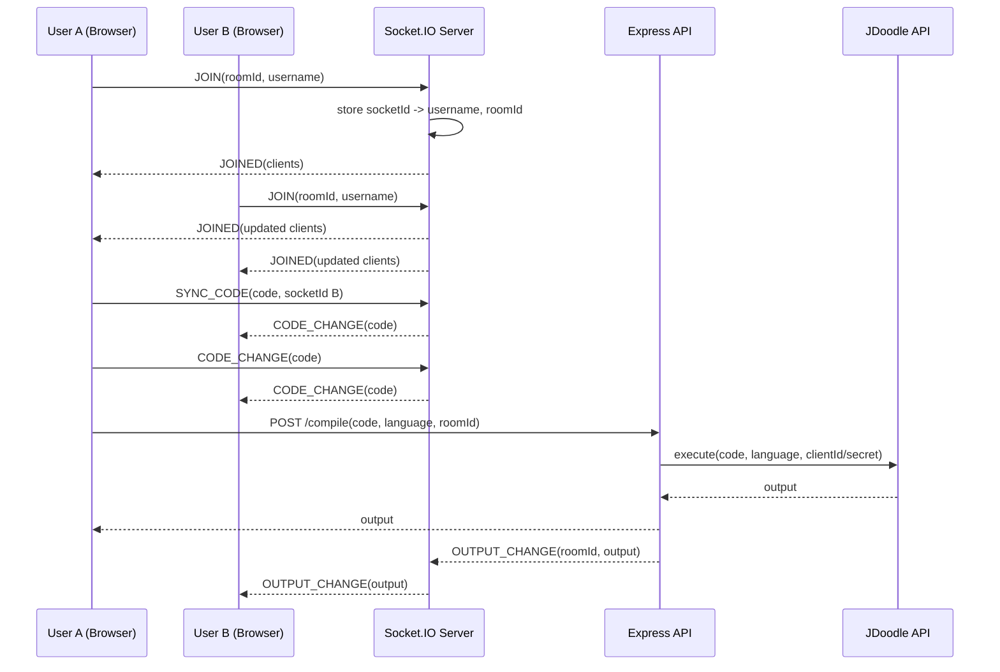

# CodeSync Deep Dive (Interview Walkthrough)

This document is a detailed, interview-ready walkthrough of the CodeSync project. It explains how the system works end to end, why each part exists, how data flows through the system, and how you can describe the design choices with clarity and confidence. It also includes diagrams (DFD, sequence, UML, and use case) in Mermaid format so you can paste them into any Markdown viewer that supports Mermaid rendering.

## 1) Project Summary

CodeSync is a real-time collaborative code editor designed for pair programming, interviews, mentoring, and remote teaching. The product goal is to give multiple users a shared coding room with synchronized editing, language switching, and shared compile output. The key promise is low-friction collaboration: users create or join a room, type together in one editor, and run code so everyone sees the same results. The system is split into a React frontend and a Node.js backend, with Socket.IO providing the real-time data layer and Express providing the REST endpoint for compilation. In production, the backend also serves the built frontend as static assets.

At a high level, the frontend is responsible for UI, routing, editor state, and socket coordination. The backend owns room membership, message broadcasting, and compile requests to the JDoodle API. The project favors simplicity and reliability, using in-memory maps for room state and a small, explicit set of socket events to keep the mental model clear in interviews.

## 2) Architecture Overview

The architecture is a classic client-server split with two types of communication:

1) Real-time: Socket.IO events for join, leave, code changes, language changes, and shared output updates.
2) Request-response: A REST endpoint (`POST /compile`) for executing code via a third-party compiler API.

The frontend uses React for the UI and routing. The editor itself is CodeMirror, which emits change events and allows programmatic updates. Socket connections are initialized with the backend URL and configured for reconnection and fallbacks (`websocket` and `polling`). The backend is an Express app that wraps a Socket.IO server. The server keeps two in-memory maps:

- `userSocketMap`: socketId -> username
- `roomSocketMap`: socketId -> roomId

These maps allow the server to reconstruct room membership and broadcast presence updates. The compile endpoint is stateless: it forwards code to JDoodle, then emits the output to the room and returns the result to the requester.

The backend also serves the frontend build in production. This makes deployment easy: a single Node process can host both API and UI, and the client can connect to the same origin unless otherwise configured.

## 3) User Journey (End-to-End Flow)

A typical flow looks like this:

1) User A opens the landing page and generates a room ID.
2) User A enters a username and navigates to `/editor/:roomId`.
3) The client initializes Socket.IO, then emits `JOIN` with room ID and username.
4) The server stores the username, associates the socket with a room, and notifies all clients in that room via `JOINED`.
5) When User B joins, the server sends a roster update and User A sends the current code using `SYNC_CODE` so User B is immediately aligned.
6) As users type, the editor emits `CODE_CHANGE`. The server broadcasts that change to all other clients in the room.
7) Users can change languages, which emits `LANGUAGE_CHANGE`. The server broadcasts that language selection to the room.
8) When a user clicks Run, the frontend calls `POST /compile` with the code and language. The server forwards to JDoodle and then emits `OUTPUT_CHANGE` to all room members.
9) When users leave or disconnect, the server emits `DISCONNECTED` to update the roster.

The result is a tight loop: edit, sync, run, share output, repeat.

## 4) Core Components and Responsibilities

### Frontend

- `HomePage`: Landing page with the hero section and feature previews.
- `Home`: Room entry page where the user generates or enters a room ID and username.
- `EditorPage`: The main collaborative editor experience. It manages socket connection, room membership, UI for participants, and compile output.
- `Editor`: CodeMirror integration. It emits local changes and applies remote changes.
- `Socket.js`: Encapsulates backend URL resolution and Socket.IO initialization.

Key frontend logic:

- The socket connection is created once per editor session and stored in a ref. This prevents unnecessary reconnections during re-renders.
- When the editor changes locally, it emits `CODE_CHANGE` unless the change was caused by `setValue` (a remote update). This prevents infinite loops.
- The compile button hits the backend REST endpoint and also updates local output state. The backend emits `OUTPUT_CHANGE` so all clients see the same results.

### Backend

- `server/index.js`: Express app and Socket.IO server. Handles CORS, compile endpoint, socket lifecycle, and static frontend serving.
- `server/Actions.js`: Shared constants for event names.

Key backend logic:

- `allowedOrigins` comes from `CLIENT_ORIGIN` env var, with fallback to localhost and a known Render URL. This constrains socket connections and API requests.
- On `JOIN`, the server records the socket and broadcasts the updated client list via `JOINED`.
- On `CODE_CHANGE`, the server relays the update to other clients in the room.
- On `LANGUAGE_CHANGE`, the server relays the selection.
- On `LEAVE` and `disconnect`, the server emits `DISCONNECTED` and cleans up maps.
- `POST /compile` forwards to JDoodle and emits `OUTPUT_CHANGE` to the room.

## 5) Data Flow Diagram (DFD)

### DFD Level 0 (Context)

### DFD Level 1 (Detailed)

## 6) Sequence Diagram (Join + Edit + Run)

## 7) Use Case Diagram (Actors and Use Cases)

