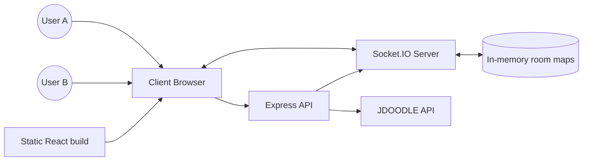
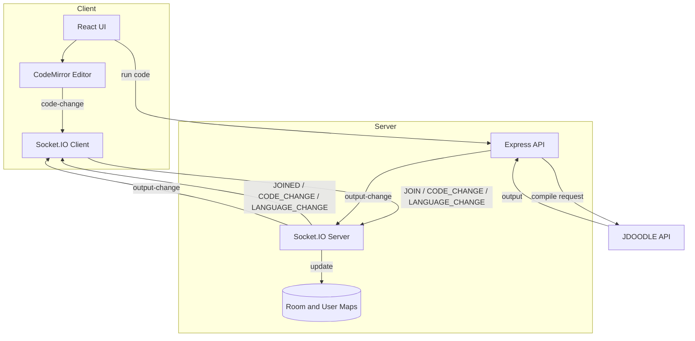
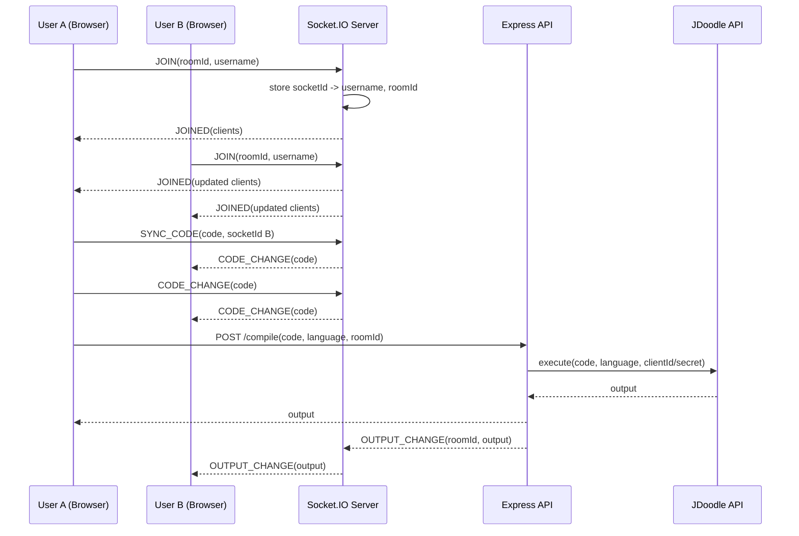
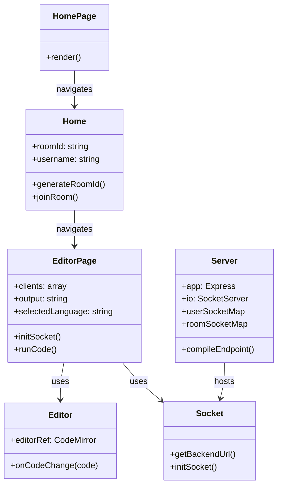
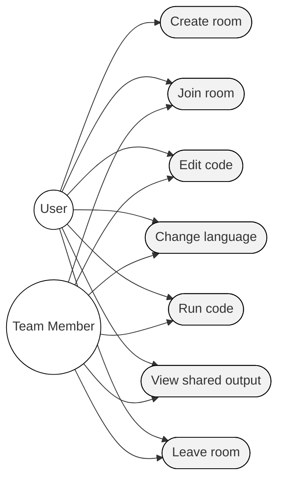

# CodeSync Deep Dive (Interview Walkthrough)

This document is a detailed, interview-ready walkthrough of the CodeSync project. It explains how the system works end to end, why each part exists, how data flows through the system, and how you can describe the design choices with clarity and confidence. It also includes diagrams (DFD, sequence, UML, and use case) in Mermaid format so you can paste them into any Markdown viewer that supports Mermaid rendering.

## 1) Project Summary

CodeSync is a real-time collaborative code editor designed for pair programming, interviews, mentoring, and remote teaching. The product goal is to give multiple users a shared coding room with synchronized editing, language switching, and shared compile output. The key promise is low-friction collaboration: users create or join a room, type together in one editor, and run code so everyone sees the same results. The system is split into a React frontend and a Node.js backend, with Socket.IO providing the real-time data layer and Express providing the REST endpoint for compilation. In production, the backend also serves the built frontend as static assets.

At a high level, the frontend is responsible for UI, routing, editor state, and socket coordination. The backend owns room membership, message broadcasting, and compile requests to the JDoodle API. The project favors simplicity and reliability, using in-memory maps for room state and a small, explicit set of socket events to keep the mental model clear in interviews.

## 2) Architecture Overview

The architecture is a classic client-server split with two types of communication:

1) Real-time: Socket.IO events for join, leave, code changes, language changes, and shared output updates.
2) Request-response: A REST endpoint (`POST /compile`) for executing code via a third-party compiler API.

The frontend uses React for the UI and routing. The editor itself is CodeMirror, which emits change events and allows programmatic updates. Socket connections are initialized with the backend URL and configured for reconnection and fallbacks (`websocket` and `polling`). The backend is an Express app that wraps a Socket.IO server. The server keeps two in-memory maps:

- `userSocketMap`: socketId -> username
- `roomSocketMap`: socketId -> roomId

These maps allow the server to reconstruct room membership and broadcast presence updates. The compile endpoint is stateless: it forwards code to JDoodle, then emits the output to the room and returns the result to the requester.

The backend also serves the frontend build in production. This makes deployment easy: a single Node process can host both API and UI, and the client can connect to the same origin unless otherwise configured.

## 3) User Journey (End-to-End Flow)

A typical flow looks like this:

1) User A opens the landing page and generates a room ID.
2) User A enters a username and navigates to `/editor/:roomId`.
3) The client initializes Socket.IO, then emits `JOIN` with room ID and username.
4) The server stores the username, associates the socket with a room, and notifies all clients in that room via `JOINED`.
5) When User B joins, the server sends a roster update and User A sends the current code using `SYNC_CODE` so User B is immediately aligned.
6) As users type, the editor emits `CODE_CHANGE`. The server broadcasts that change to all other clients in the room.
7) Users can change languages, which emits `LANGUAGE_CHANGE`. The server broadcasts that language selection to the room.
8) When a user clicks Run, the frontend calls `POST /compile` with the code and language. The server forwards to JDoodle and then emits `OUTPUT_CHANGE` to all room members.
9) When users leave or disconnect, the server emits `DISCONNECTED` to update the roster.

The result is a tight loop: edit, sync, run, share output, repeat.

## 4) Core Components and Responsibilities

### Frontend

- `HomePage`: Landing page with the hero section and feature previews.
- `Home`: Room entry page where the user generates or enters a room ID and username.
- `EditorPage`: The main collaborative editor experience. It manages socket connection, room membership, UI for participants, and compile output.
- `Editor`: CodeMirror integration. It emits local changes and applies remote changes.
- `Socket.js`: Encapsulates backend URL resolution and Socket.IO initialization.

Key frontend logic:

- The socket connection is created once per editor session and stored in a ref. This prevents unnecessary reconnections during re-renders.
- When the editor changes locally, it emits `CODE_CHANGE` unless the change was caused by `setValue` (a remote update). This prevents infinite loops.
- The compile button hits the backend REST endpoint and also updates local output state. The backend emits `OUTPUT_CHANGE` so all clients see the same results.

### Backend

- `server/index.js`: Express app and Socket.IO server. Handles CORS, compile endpoint, socket lifecycle, and static frontend serving.
- `server/Actions.js`: Shared constants for event names.

Key backend logic:

- `allowedOrigins` comes from `CLIENT_ORIGIN` env var, with fallback to localhost and a known Render URL. This constrains socket connections and API requests.
- On `JOIN`, the server records the socket and broadcasts the updated client list via `JOINED`.
- On `CODE_CHANGE`, the server relays the update to other clients in the room.
- On `LANGUAGE_CHANGE`, the server relays the selection.
- On `LEAVE` and `disconnect`, the server emits `DISCONNECTED` and cleans up maps.
- `POST /compile` forwards to JDoodle and emits `OUTPUT_CHANGE` to the room.

## 5) Data Flow Diagram (DFD)

### DFD Level 0 (Context)

### DFD Level 1 (Detailed)

## 6) Sequence Diagram (Join + Edit + Run)

## 7) UML Diagram (High-Level Classes / Modules)

## 8) Use Case Diagram (Actors and Use Cases)

## 9) State and Synchronization Details

The core synchronization problem is making sure every participant sees the same code and output. CodeSync handles this in a pragmatic way:

- Each editor instance emits change events for local edits.
- For remote updates, the editor uses `setValue`, and the handler ignores events from `setValue` to avoid echoing remote edits back to the server.
- When a new user joins, the existing client sends a full copy of the current code buffer using `SYNC_CODE`.
- Output is centralized through the backend: the compile endpoint emits `OUTPUT_CHANGE` after receiving the JDoodle response. This makes output authoritative and consistent across the room.

Because the server keeps only room membership and usernames in memory, there is no persistent storage. That keeps the server simple and fast, but it also means that if the server restarts, rooms are lost. This is a trade-off that is acceptable for interview-style or session-based use. In an interview, you can point out this design choice and describe how you could add persistence later.

## 10) Failure Modes and Recovery

- Socket connection failures: The client displays a toast and navigates back to the landing page. Socket.IO is configured to reconnect with infinite attempts.
- Network drop: The client reconnects and re-emits `JOIN` to re-establish presence.
- Compile failures: The server returns a 500 error with details from JDoodle, and the UI can display errors.
- Unsupported languages: The server checks the language against a configuration map and rejects unsupported values.

The server also enables `connectionStateRecovery` in Socket.IO, which helps clients resume sessions after transient disconnects.

## 11) Security and Privacy Considerations

- CORS is restricted to known origins using `CLIENT_ORIGIN` with a fallback allowlist for local development and a known production URL.
- The JDoodle credentials are stored in environment variables and never exposed to the client.
- The system does not store code or user identities in a database. This limits data exposure but also means there is no audit trail.
- If this were deployed for broader use, you would likely add authentication, rate limits, and room access controls.

## 12) Performance and Scalability

The system is designed for small rooms with real-time synchronization. The server broadcasts every code change to all sockets in the room. This is simple and responsive, but it does not optimize for very large rooms or high frequency changes. Some performance strategies you could propose in an interview include:

- Debouncing or batching code changes.
- Sending diffs instead of full code payloads.
- Offloading state to a cache or database if you need persistence or recovery.
- Horizontal scaling with a shared Socket.IO adapter (e.g., Redis) for multi-instance deployments.

## 13) Deployment and Environment Configuration

This repo supports a single-service Render deployment where the backend serves the frontend build. The root `package.json` includes build and start scripts. Recommended configuration:

- Build command: `npm run build`
- Start command: `node server/index.js` (or `npm start` if it maps to the same)

Environment variables to set:

- `REACT_APP_BACKEND_URL`: Backend URL used by the client in production.
- `CLIENT_ORIGIN`: Allowed frontend origin for CORS and Socket.IO.
- `JDOODLE_CLIENT_ID` and `JDOODLE_CLIENT_SECRET`: Credentials for compilation.

If you deploy frontend and backend separately, `REACT_APP_BACKEND_URL` should point to the backend service and `CLIENT_ORIGIN` should point to the frontend service.

## 14) How to Explain the Design in an Interview

When you present CodeSync, focus on the problem and the real-time collaboration constraints. A clear narrative is:

1) The user needs a shared room where code and output are synchronized in real time.
2) We split the system into a client for UI and a server for state and coordination.
3) Socket.IO provides reliable, low-latency sync for edits and presence changes.
4) The compile endpoint stays on the server to protect credentials and centralize output.
5) We keep state in memory for simplicity and responsiveness.

Then, you can highlight trade-offs and improvements. For example, in-memory rooms are fast but not persistent; and broadcasting full code is simple but could be optimized with patches or OT/CRDT in a larger system. This shows you understand both the current design and how to evolve it.

## 15) Summary

CodeSync is a cohesive, interview-ready example of a real-time collaboration system. The frontend focuses on user flow, editor integration, and socket lifecycle management. The backend handles room membership, event broadcasting, and compilation via JDoodle. The architecture is intentionally simple but well-structured, which makes it easy to explain in interviews. The diagrams above give you a visual way to walk through the system, and the detailed explanation provides a story you can tell from user action to server response.

## 16) Tech Stack Rationale (Why This Stack)

This project intentionally uses a stack that is easy to explain, fast to build with, and strong for real-time interaction.

- React: React enables component-level composition and predictable state management. The editor UI, participant list, output panel, and landing page are cleanly separated, which makes the application easier to reason about in interviews. React Router simplifies navigation between the landing page and the editor room. Hooks like `useEffect` and `useRef` are ideal for managing Socket.IO lifecycles and editor instances without re-initializing them on each render.

- Node.js + Express: The backend needs to handle both real-time events and a REST endpoint for compilation. Node.js is a natural fit because Socket.IO is JavaScript-first and integrates smoothly with Express. Express is minimal yet flexible, making it easy to define a single, clear endpoint (`POST /compile`) and host static assets in production.

- Socket.IO: Real-time collaboration requires low-latency communication, reconnection handling, and simple publish-subscribe semantics. Socket.IO gives WebSocket support with graceful fallback to HTTP polling, which is practical in real-world network environments. It also supports connection recovery and room-based broadcasting, which align perfectly with the room concept in CodeSync.

- CodeMirror: The editor must provide syntax highlighting, line numbers, and editable text with programmatic updates. CodeMirror provides mature editor tooling and integrates well with React via a custom wrapper. It supports event hooks for change detection and lets the app differentiate local edits from remote updates.

- JDoodle API: Supporting multi-language compilation locally would require sandboxes and runtime images. JDoodle offers a straightforward hosted execution API, which keeps the backend lean. The server remains responsible for authentication and output synchronization without exposing credentials to the client.

- Render deployment: Render makes it easy to deploy a combined Node + React application. A single build pipeline and start command allow quick iteration. The environment variable model aligns with the configuration needed for CORS and JDoodle credentials.

## 17) Explicit Trade-offs

Every design decision in CodeSync comes with trade-offs. You can highlight these in interviews to demonstrate engineering judgment.

1) In-memory room state vs persistence: Keeping room membership in memory is fast and simple, but rooms vanish after a server restart. This is acceptable for short-lived sessions, but persistent rooms would require a database or cache.

2) Full code broadcast vs diffs: Sending the entire code string on every change simplifies the implementation but is not optimal for large files or rapid edits. A more scalable solution would send diffs or use OT/CRDT techniques.

3) Single server instance vs horizontal scaling: The current design assumes one server instance. Scaling to multiple instances would require a Socket.IO adapter (like Redis) to sync rooms across nodes.

4) Third-party compilation vs local sandbox: JDoodle reduces operational complexity, but introduces latency and a dependency on a third-party service. A local sandbox would provide more control but requires heavier infrastructure and security hardening.

5) Simple CORS allowlist vs full auth: CORS is set with known origins, but there is no user authentication or access control. Adding auth would improve security but increase onboarding friction.

6) Single-service deploy vs split services: Serving the frontend from the backend simplifies deployment, but limits independent scaling. Splitting services offers flexibility but introduces coordination and CORS configuration complexity.

## 18) Interview Questions and Detailed Answers (50)

1) Q: What is the core problem CodeSync solves?
   A: CodeSync solves the problem of real-time collaborative coding in a shared room, where multiple users can edit the same file and run code together. Traditional collaboration tools are chat- or screen-sharing-focused; CodeSync gives an actual shared editor with synchronized output. The core requirement is low-latency synchronization and a simple join flow so users can start coding immediately.

2) Q: Why did you choose Socket.IO instead of raw WebSockets?
   A: Socket.IO provides reliable fallbacks, reconnection, and room-based broadcasting out of the box. In real environments, users may be behind proxies or on unstable connections, and Socket.IO’s automatic fallback to polling keeps the app functional. It also gives a clean event-driven API that maps directly to collaboration concepts like `JOIN`, `CODE_CHANGE`, and `OUTPUT_CHANGE`.

3) Q: How does the system ensure all users see the same code?
   A: The editor emits `CODE_CHANGE` on local edits and the server broadcasts those updates to everyone else in the room. When a user joins, the existing client sends the full code buffer via `SYNC_CODE` to initialize the new user. Remote updates use `setValue`, and the editor ignores `setValue`-origin changes so updates are not re-broadcast.

4) Q: How is room membership tracked on the server?
   A: The server keeps two in-memory maps: `userSocketMap` maps socket IDs to usernames, and `roomSocketMap` maps socket IDs to room IDs. When a socket joins, the server stores these mappings and uses the Socket.IO room system to broadcast events to the correct group. On disconnect, it cleans up these mappings.

5) Q: What happens when a user disconnects unexpectedly?
   A: The server listens for `disconnect`, removes the user from maps, and emits `DISCONNECTED` to the room so the UI can update the participant list. On the client, Socket.IO’s reconnection behavior attempts to rejoin. When reconnected, the client re-emits `JOIN` to restore its presence.

6) Q: Why use a REST endpoint for compilation instead of sockets?
   A: Compilation is a request-response workflow with a clear input and output. Using a REST endpoint keeps this path stateless and easy to debug, and it allows the server to authenticate with the JDoodle API securely. The server then emits `OUTPUT_CHANGE` to sockets so all clients still see the shared output.

7) Q: How does the compile feature avoid exposing JDoodle credentials?
   A: The client never calls JDoodle directly. Instead, it calls the backend `/compile` endpoint. The backend injects the `JDOODLE_CLIENT_ID` and `JDOODLE_CLIENT_SECRET` from environment variables, forwards the request to JDoodle, and returns the output.

8) Q: How do you prevent infinite echo loops in the editor?
   A: CodeMirror emits change events for both user edits and programmatic updates. When the editor receives a remote change, it applies it using `setValue`. The change handler checks `origin !== "setValue"` before emitting a `CODE_CHANGE`, preventing remote updates from being broadcast again.

9) Q: How does CodeSync handle language changes across users?
   A: When a user selects a new language, the client emits `LANGUAGE_CHANGE` with the room ID. The server broadcasts that selection to all other clients in the room. Each client updates its local `selectedLanguage` state to keep the UI consistent.

10) Q: Why use CodeMirror instead of Monaco Editor?
  A: CodeMirror is lightweight and mature, with excellent support for custom event handling and direct integration into a React component. It provides the features we need such as syntax highlighting, line numbers, and programmatic setValue. Monaco is more powerful but heavier and could slow initial load for a lightweight collaboration tool.

11) Q: How would you scale this for many rooms and users?
  A: First, I would add a shared Socket.IO adapter (like Redis) so multiple server instances can share room state. Then I would offload room metadata to a cache or database to persist presence data. For the editor, I would throttle or debounce updates, or send diffs instead of full code strings.

12) Q: What are the trade-offs of in-memory room state?
  A: In-memory state is fast and easy, but it is not persistent. A server restart clears all rooms and participants. If the product needed persistence, we would store room membership and last code snapshot in a database or cache, which adds complexity but supports recovery.

13) Q: How is CORS configured and why is it important?
  A: The backend uses `CLIENT_ORIGIN` to set the allowed origins for both Express and Socket.IO. This prevents unauthorized sites from making requests or establishing socket connections. In production, it ensures only the deployed frontend can access the backend.

14) Q: How does the client decide the backend URL?
  A: The client uses `REACT_APP_BACKEND_URL` if present. If not, it uses a production default or localhost depending on the environment. This keeps local development easy while allowing production configuration through environment variables.

15) Q: What would you improve for security if this went to production?
  A: I would add authentication and authorization for room access, rate limiting for compile requests, and optional room passwords. I would also validate input sizes and add server-side throttling to protect against abuse.

16) Q: How does the system handle reconnection after a network drop?
  A: Socket.IO automatically retries connections. When the client reconnects, it re-emits `JOIN` to re-register the user in the room. The server then includes the user in the client list and the room state is restored.

17) Q: How does the server broadcast the participant list?
  A: On each `JOIN`, the server compiles the list of connected sockets in the room and emits `JOINED` with the client list to all members. This list is built by looking up each socket ID in `userSocketMap`.

18) Q: How do you ensure the compile output is consistent for all users?
  A: The backend sends the compile request to JDoodle and, upon success, emits `OUTPUT_CHANGE` to the entire room. Every client listens for this event and updates its output panel, so everyone sees the same output.

19) Q: Why does the backend serve the frontend build?
  A: Serving the frontend from the backend simplifies deployment because only one service is needed. It also ensures the client and server share the same origin, which reduces CORS complexity. This is well-suited for small deployments and demos.

20) Q: What is the role of `connectionStateRecovery`?
  A: It allows Socket.IO to recover state after short disconnects by preserving certain session details. This reduces the likelihood that users are dropped from rooms due to brief network issues. It improves the overall collaboration experience without a complex reconnection protocol.

21) Q: How would you handle very large code files?
  A: I would avoid sending the entire buffer on each change. Instead, I would send incremental diffs, use a CRDT library, or apply OT (operational transform) so that only the smallest changes are transmitted. This reduces bandwidth and CPU usage on both server and clients.

22) Q: Why use a separate `Actions.js` for socket event names?
  A: It centralizes event names so both client and server use the same constants. This reduces errors caused by mismatched strings and makes the event contract explicit. It also makes future refactors safer.

23) Q: How do you prevent a client from joining without a username or room ID?
  A: The client validates both fields before navigation. The server also checks that `roomId` and `username` are present in the `JOIN` payload and disconnects the socket if either is missing. This double validation keeps the room state consistent.

24) Q: What would you store if persistence was required?
  A: I would store room metadata (room ID, member list, last code snapshot, selected language) in a database or cache. The compile output could also be saved to allow a new user to see the latest output immediately after joining.

25) Q: Why not store the full code in the backend on every change?
  A: The current design treats the server as a relay rather than a source of truth for code. This avoids server-side state bloat and keeps the backend simpler. If you needed persistence or recovery, you could store snapshots periodically or store diffs.

26) Q: How does the editor component avoid re-initializing on every render?
  A: The CodeMirror instance is stored in a ref and created once inside a `useEffect` hook. This ensures it is initialized only once, and React re-renders do not destroy or recreate it unnecessarily.

27) Q: What happens if JDoodle is down or slow?
  A: The backend catches errors from JDoodle and returns a 500 response with details. The UI can show an error message. If availability becomes a concern, a circuit breaker or fallback execution system could be added.

28) Q: How do you ensure room isolation so messages do not leak across rooms?
  A: Socket.IO rooms isolate event broadcasting. When emitting `CODE_CHANGE`, the server uses `socket.in(roomId)` so only the relevant room receives updates. This isolates collaboration to the intended participants.

29) Q: What are the main UI states in the editor page?
  A: The editor page tracks the list of clients, the current output, the selected language, whether the compile panel is open, and connection status. These states allow the UI to update immediately when sockets connect, users join or leave, or output changes.

30) Q: Why use `useRef` for socket and code state?
  A: A ref provides a stable object reference across renders. This is important for the socket connection, which should not be recreated on each render. A ref also allows code to be accessed by event handlers without triggering re-renders on each keystroke.

31) Q: How does the app prevent multiple sockets from being created?
  A: The socket is created once inside `useEffect` and stored in a ref. The effect runs only when room ID changes. Cleanup disconnects the socket when the component unmounts, ensuring only one active socket per session.

32) Q: What is the role of `SYNC_CODE`?
  A: It synchronizes the current code buffer to a newly joined user. The existing user emits `SYNC_CODE` to the socket ID of the new user, ensuring the newcomer starts with the correct code state.

33) Q: How does the code handle simultaneous edits?
  A: Edits are broadcast in real time, but the current implementation is last-write-wins. It does not resolve conflicting edits with advanced algorithms like OT or CRDT. For small rooms and low contention, this works acceptably; for high contention, a more robust syncing strategy is needed.

34) Q: Why is the compile output emitted to the room as well as returned to the requester?
  A: The REST response provides immediate feedback to the requester, while the socket broadcast ensures every participant receives the same output. This keeps the UI consistent for all users without requiring each user to re-run the compile.

35) Q: How would you add authentication?
  A: I would introduce JWT-based auth or an OAuth flow for identity, then attach the user identity to socket connections. The server would check that a user is allowed to join a specific room. This could also enable private rooms or organization-level access control.

36) Q: How do you prevent a user from spamming compile requests?
  A: You can add rate limiting at the REST endpoint level and optionally add a cooldown on the client. This prevents abuse of JDoodle and keeps the system responsive for other users.

37) Q: What parts of the system are most critical for reliability?
  A: Socket connection stability and compile endpoint availability are the most critical. If sockets fail, collaboration breaks; if compilation fails, the shared output feature becomes unusable. These are the primary areas to monitor and harden.

38) Q: How does the system handle versioning of the API or socket events?
  A: Right now the event names are stable constants. If versioning were needed, we could namespace events or include a protocol version in the initial handshake. This would allow backward compatibility during rollouts.

39) Q: Why not use GraphQL for the compile API?
  A: The compile interaction is a simple request-response. GraphQL would add unnecessary complexity. A REST endpoint is straightforward and easy to debug, especially for a single operation like compilation.

40) Q: How would you reduce bandwidth usage during editing?
  A: I would debounce changes and send diffs rather than full documents. This could be implemented by tracking cursor positions and diffing code locally, or by adopting a CRDT library that naturally transmits operations.

41) Q: How do you handle output formatting for multiple languages?
  A: The output is treated as a plain string returned by JDoodle. The server sends it as-is to the room. If formatting or syntax highlighting is needed, the client can detect output type and format accordingly.

42) Q: What monitoring or logging would you add in production?
  A: I would add structured logs for socket joins/leaves, compile requests, and errors. I would also add metrics on socket counts, compile latency, and failure rates. This helps detect issues like spikes in compile failures or unexpected disconnects.

43) Q: How does the UI update the client list?
  A: The server emits `JOINED` with a list of all connected clients. The frontend stores this list in state and maps it to UI components. When a user disconnects, the server emits `DISCONNECTED` and the client filters out the leaving socket ID.

44) Q: What happens if a user joins with the same username?
  A: The current design does not enforce unique usernames. Two users can share the same name, which is a trade-off for simplicity. A future improvement would be to enforce uniqueness per room or append a suffix.

45) Q: How do you ensure the frontend does not break when the backend URL changes?
  A: The frontend reads the backend URL from an environment variable at build time. This allows different URLs for staging and production without code changes. The fallback logic ensures local development still works even when the variable is absent.

46) Q: What is the rationale for using a single-language configuration map on the server?
  A: The map defines which languages are supported and which version index to use for JDoodle. This centralizes language configuration and prevents invalid requests. It also makes it easy to add new languages by extending the map.

47) Q: How would you test this system?
  A: I would test frontend components with React Testing Library, mock socket events for the editor page, and add integration tests for the `/compile` endpoint using a test double for JDoodle. For sockets, I would use a Socket.IO test client to simulate joins and code updates.

48) Q: What is the biggest limitation of the current collaboration model?
  A: The biggest limitation is the lack of operational transform or CRDT, which means concurrent edits are not merged intelligently. For two or three users, the system behaves well enough, but for heavy concurrent edits it can cause conflicts or overwrites.

49) Q: How does the project balance simplicity and capability?
  A: It prioritizes a minimal implementation that delivers a working collaborative editor with shared output. It intentionally avoids heavier features like authentication, persistence, or diff-based syncing. This keeps the codebase approachable for interviews while still demonstrating core system design concepts.

50) Q: If you had one week to improve this project, what would you do?
  A: I would add persistent room state and a better synchronization algorithm, such as a CRDT library. I would also add rate limiting and basic authentication to secure the system. Finally, I would improve observability with logs and metrics so failures can be diagnosed quickly in production.
